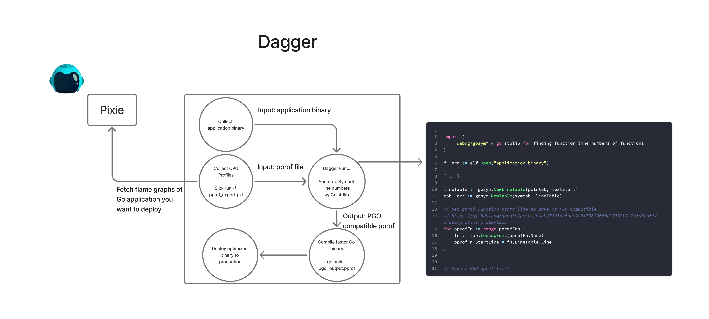
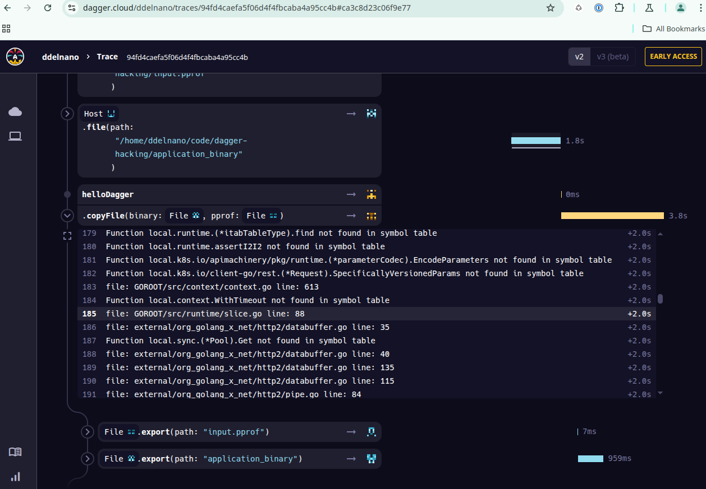

## Faster Go applications with Dagger and Pixie

Go has supported Profile Guided Optimization (PGO) since version 1.20, which allows you to optimize your Go applications based on profiling data. This can lead to significant performance improvements, especially for CPU-bound applications.

However, many teams don't have access to continuous profiling data in production, which makes it difficult to take advantage of PGO. This is where Dagger and Pixie come in.

[CNCF Pixie](https://px.dev/) is a powerful open-source observability tool that provides continuous profiling for your applications. It allows you to collect profiling data from your production environment and use it to optimize your Go applications.

Dagger is a powerful open-source CI/CD tool that allows you to build, test, and deploy your applications in a fast and efficient way. It provides a simple and flexible way to define your CI/CD pipelines using code.

Pairing the two tools together allows for creating an end-to-end experience for building, testing, and deploying Go applications with PGO. This guide will walk you through the process of using Dagger and Pixie to optimize your Go applications with PGO.

The overall architecture of the solution is outlined in the picture below:



To summarize, Pixie is used to capture non-PGO capatible CPU profiles. Since Pixie instruments all applications in a cluster, you get streamlined access to these profiles after installing Pixie. From there, Dagger will orchestrate the process of collecting the profiles from Pixie, annotating the raw profile from Pixie with the necessary information to make it PGO compatible, and then using the PGO compatible profile to build a new Go binary. The new binary can then be deployed to the cluster and can be inserted into the CI/CD pipeline of the Go application.

[!NOTE]
At this time, the Dagger integration is still incomplete see the TODO list below for the remaining steps to complete the integration. The Instructions section below will be updated as the outstanding todos are completed.

## TODO
- [ ] Add Dagger step to push the new binary to the k8s cluster

## Prerequisites
- A k8s cluster with Pixie installed -- the cli instructions from above will also install Pixie on your cluster.
- Dagger installed -- follow the instructions [here](https://docs.dagger.io/install) to install Dagger.

## Instructions
```
dagger call create-pgo-profile --gcloud-config ~/.config/gcloud  --kubeconfig ~/.kube/config --api-key 'env:PX_API_KEY' --deployment-name 'pl/vizier-cloud-connector' --cloud-addr='testing.getcosmic.ai:443' --container-name=app export --path output.pprof
```
- View Dagger trace to see that the pprof functions are being annotated properly (see logs collected from adhoc run)

```
file: external/org_golang_x_net/http2/databuffer.go line: 35
Function local.sync.(*Pool).Get not found in symbol table
file: external/org_golang_x_net/http2/databuffer.go line: 40
file: external/org_golang_x_net/http2/databuffer.go line: 135
file: external/org_golang_x_net/http2/databuffer.go line: 115
file: external/org_golang_x_net/http2/pipe.go line: 84
```


